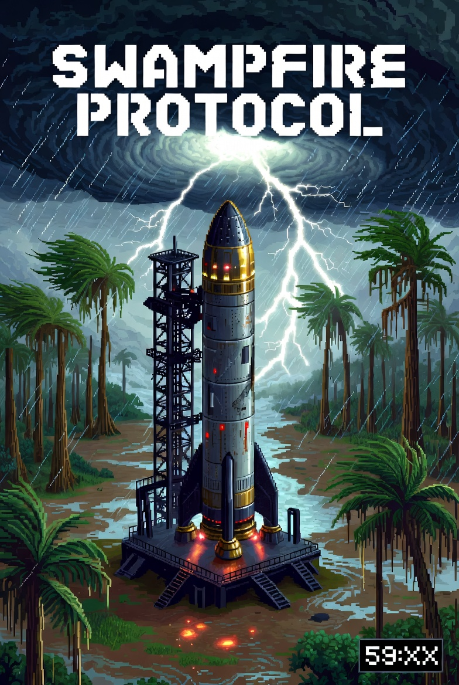

# Swampfire Protocol



> "What do you mean the hurricane is in 60 minutes?! I haven't even found the fuel injector yet!"
> — Juan, probably

A hurricane hits in 60 minutes. Juan has a half-built rocket in the swamp. Scavenge the real streets of Land O' Lakes, FL 34639 for parts, slam them together, and launch before the storm erases everything — in one breathless hour.

No pressure. Well, actually, a lot of pressure. Like, hurricane-force pressure. Literally.

**Play it now:** <a href="https://swampfire.messana.ai/" target="_blank">https://swampfire.messana.ai/</a>

*(Fair warning: if you fail, Juan gets hurricane'd.)*

---

## Gameplay

You are Juan. Hurricane Kendra makes landfall in 60 minutes. Your only way out is a rocket — but it needs four systems you don't have yet.

**The loop:**
1. **Scavenge** — search toolboxes, coolers, crates, and backpacks across four zones for crafting ingredients
2. **Craft** — bring ingredients to the workbench to build rocket components (Fuel Injector, Oxidizer Tank, Avionics Board, Battery Array)
3. **Install** — carry each finished component to the rocket and press E
4. **Launch** — once all four systems are installed, press E at the rocket to trigger the launch cinematic and escape

Miss the window and Kendra wins. Juan's Florida Man death headline will be generated for you.

---

## The World

Four zones based on real Land O' Lakes, FL geography — all connected and traversable:

| Zone | Location | Vibe |
|---|---|---|
| **Zone 0** — Cypress Creek Preserve | Your starting area. The rocket is here. | Swamp, cypress trees, water hazards |
| **Zone 1** — US-41 Corridor | Strip mall row: RaceTrac, Harvey's Hardware, NAPA, O'Reilly | Downed power lines, looters in Phase 3+ |
| **Zone 2** — Collier Commons | Publix, Library/Foundry, Rec Center | Dense containers, NPC side quests |
| **Zone 3** — Conner Preserve | RC Flying Field, Fire Tower | Rattlesnakes, remote wilderness |
| **Zone 4** — LOLHS / SR-54 | High school, chem lab, Tractor Supply | Flooding, storm debris |

---

## The Storm

Hurricane Kendra has four escalating phases tied to the countdown timer:

| Phase | Time Remaining | Effects |
|---|---|---|
| 1 | 60–45 min | Light rain overlay, green HUD |
| 2 | 45–30 min | Moderate rain, blue flash, yellow HUD, looters spawn |
| 3 | 30–15 min | Heavy rain, screen shake, 28% darkness, power lines fall, flooding |
| 4 | 15–0 min | Intense rain, looping shake, lightning, 50% darkness, red HUD |

---

## Controls

| Key | Action |
|---|---|
| `WASD` | Move |
| `Shift` | Sprint (unlimited) |
| `E` | Interact (search containers, craft, install, launch) |

---

## Mechanics

- **XP & Combos** — loot, craft, and install in quick succession to build combo streaks (DOUBLE → TRIPLE → QUAD → FRENZY). FRENZY gives 1.5× XP for 5 seconds and a screen flash
- **Achievements** — 8 permanent milestones tracked in localStorage: first loot, first craft, first install, all systems, explorer, globe trotter, first frenzy, survivor
- **NPCs** — Harvey, Maria, Old Dale, and Coach Reeves offer side quests that reward XP and unlock recipes
- **End-of-run share card** — win or lose, you get a shareable stats card with your time, XP, combos, and zones visited
- **Under-the-Wire** — launch with less than 2 minutes remaining for a bonus achievement

---

## Tech Stack

- [Phaser 3.80+](https://phaser.io/) with Matter.js physics (top-down, zero gravity)
- [Vite](https://vitejs.dev/) build system
- Zone music via [Suno AI](https://suno.com/) — five OGG loop tracks, one per zone
- Arcade cabinet surround UI — pure HTML/CSS CRT frame with neon header and animated circuit panels
- Deployed to GitHub Pages

---

## Development

```bash
npm install
npm run dev        # dev server at localhost:5173
npm run build      # production build
```

To run E2E tests locally, install Playwright browser binaries once:

```bash
npx playwright install chromium
```

Then run tests:

```bash
npm test           # unit tests (391 tests)
npm run test:e2e   # E2E tests (Playwright)
npm run test:all   # both
```

---

## Project Structure

```
src/
  scenes/          # Phaser scenes: bootloader, splash, transition, game, hud, outro
  gameobjects/     # Player, Rocket, Workbench, SearchableContainer, NPCs, hazards
  zone_manager.js  # Loads Tiled JSON maps, manages zone transitions and cleanup
public/
  assets/
    maps/          # zone0-4.json (Tiled tilemaps)
    music/         # menu_theme.ogg + zone0-4 OGG loops
    sounds/        # SFX (legacy dungeon sounds, being replaced in Phase 5.3c)
    images/        # tilesets, player spritesheet, cover art
```

---

## Why Florida?

Because if you're going to build a rocket in a swamp with 60 minutes before a category-whatever hurricane, you're doing it in Florida. This is just how things work there. The alligators are used to it.

---

## Origin

Forked from the "Dungeon Bobble" example in [Phaser by Example](https://github.com/phaserjs/phaser-by-example) by Pello. Incrementally refactored into a top-down hurricane scavenger game — a sentence that has never been typed before in the history of software development.

See [TODO.md](TODO.md) for the full build log. (Spoiler: Juan finally has a working rocket.)

---

## Reference Links

- [phaser-matter-collision-plugin docs](https://mikewesthad.github.io/phaser-matter-collision-plugin/docs/)
- [Bitmap font generator (snowb)](https://snowb.org/)
- [Modular game worlds in Phaser 3 — Tilemaps](https://itnext.io/modular-game-worlds-in-phaser-3-tilemaps-3-procedural-dungeon-3bc19b841cd)
- [Suno AI music generation](https://suno.com/)
